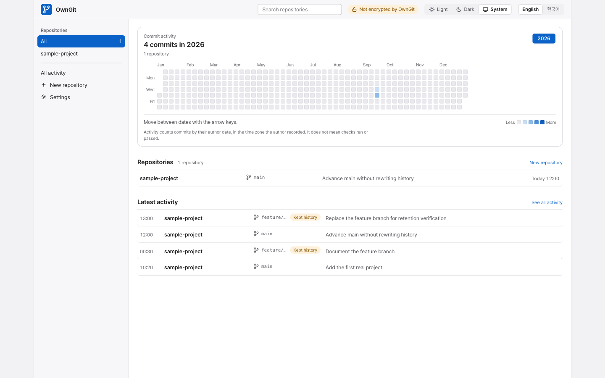

<p align="center">
  
</p>

<h1 align="center">OwnGit</h1>

<p align="center">
  <a href="CHANGELOG.md"></a>
  <a href="CHANGELOG.md"></a>
  <a href="LICENSE"></a>
  <a href="https://github.com/juliankang4/homebrew-tap"></a>
  <a href="https://www.npmjs.com/package/owngit"></a>
  <a href="https://go.dev"></a>
  <a href="https://www.sqlite.org"></a>
</p>

<p align="center"><a href="README.md">English</a> | <b>한국어</b></p>

OwnGit은 홈랩과 로컬 컴퓨터를 위한 셀프 호스팅 Git 서버입니다. 비공개 저장소와 그 기록을 내 컴퓨터, NAS, 홈 서버에 두고 평소 작업은 브라우저 대시보드에서 합니다. 저장소는 호스트에 설치된 Git이 제공하는 평범한 bare Git 저장소 그대로입니다. 클라우드 Git 계정이나 구독이 필요 없습니다.



## 주요 기능

- 일반 Git 클라이언트에서 Smart HTTP로 clone, fetch, push를 할 수 있습니다.
- 저장소, 브랜치, 태그, 파일, 커밋, diff, 작성일 기준 활동, 풀 리퀘스트, 특정 리비전에 묶인 체크 결과를 브라우저에서 보여 줍니다.
- 브라우저에서 풀 리퀘스트를 만들고 화면에 보이는 바로 그 리비전으로 병합합니다. 풀 리퀘스트는 병합하지 않고 닫았다가 다시 열 수도 있습니다. JSON CLI 명령으로도 풀 리퀘스트를 만들고, 살펴보고, 리뷰하고, 병합하고, 닫고, 다시 열 수 있습니다. 풀 리퀘스트 없이 평소처럼 `git push`해도 되며 리뷰는 선택 사항입니다.
- 체크 에이전트가 사용자 환경에서 실행한 체크 결과를 기록합니다. 소유자가 켠 자동 체크는 호스트, 제한된 로컬 Docker, 별도 러너에서 실행할 수 있습니다. 체크와 리뷰는 참고용이며 병합을 막지 않습니다.
- 다른 HTTPS Git 호스트에서 저장소를 가져오고 필요할 때나 예약한 시각에 새로 고칩니다. 원본에는 아무것도 쓰지 않습니다.
- 덮어쓰거나 삭제한 브랜치와 태그의 기록을 숨은 ref에 보관합니다. 브라우저에서 바뀌는 내용을 모두 미리 본 뒤 트리 전체나 고른 파일을 되돌릴 수 있습니다.
- 저장소의 ref와 객체, 풀 리퀘스트 기록, 체크 기록, 가져오기 기록, 다른 설치로 옮길 수 있는 설정을 오프라인 백업으로 만들고 복원합니다.
- Go 실행 파일 하나와 호스트에 있는 SQLite 데이터베이스로 동작합니다. 실행할 때 Node, Python, 데이터베이스 서비스가 필요 없습니다.
- 영어와 한국어 화면을 제공하며 라이트, 다크, 시스템 화면 모드를 지원합니다.

## 설치

어느 방법으로 설치하든 호스트에 실행 가능한 `git-http-backend`가 들어 있는 Git이 필요합니다. Homebrew는 Git을 함께 설치합니다.

macOS(Apple silicon)나 Linux(x64, ARM64)에서 [Homebrew](https://brew.sh)로 설치합니다.

```sh
brew install juliankang4/tap/owngit
```

macOS(Apple silicon), Linux(x64, ARM64), Windows(x64)에서는 [npm](https://www.npmjs.com/package/owngit)으로도 설치할 수 있습니다. 이 방법은 설치할 때와 OwnGit을 시작할 때 Node.js가 필요합니다.

```sh
npm install -g owngit
```

[GitHub Releases](https://github.com/juliankang4/owngit/releases)에서 플랫폼에 맞는 압축 파일을 내려받아 `SHA256SUMS`로 확인해도 됩니다. 실행 파일에는 서명이 없습니다. macOS에서 브라우저로 내려받은 실행 파일이 실행되지 않으면 `xattr -d com.apple.quarantine owngit`을 한 번 실행하세요.

소스에서 빌드하려면 Go 1.27 이상이 필요합니다.

```sh
git clone https://github.com/juliankang4/owngit.git
cd owngit
go build -o bin/owngit ./cmd/owngit
```

## 빠른 시작

```sh
owngit serve
```

소스에서 빌드했다면 `./bin/owngit serve`, 압축 파일을 풀었다면 `./owngit serve`로 실행합니다. 처음 실행하면 OwnGit이 상태 디렉터리 안에 설치한 계정만 읽을 수 있는 설정 파일을 만들고 브라우저에서 엽니다. 그 화면의 안내를 따르세요. 설정용 비밀값은 화면에 출력되거나 브라우저 인수로 전달되지 않습니다. `--no-open`을 붙였거나 브라우저를 열 수 없으면 서버 로그에 파일 경로가 나옵니다. 기본 주소는 `http://127.0.0.1:7654`입니다.

Homebrew로 설치했다면 `brew services start owngit`으로 로그인할 때 OwnGit이 켜지게 할 수 있습니다. 로그는 `$(brew --prefix)/var/log/owngit.log`에 남고, 처음 시작할 때의 설정 파일 경로도 여기에 적힙니다.

대시보드에서 저장소를 만든 뒤 그 clone 주소(예: `http://127.0.0.1:7654/git/project.git`)를 아무 Git 클라이언트에서나 쓰면 됩니다. 다른 기기에서 접속하기, 기존 저장소 옮기기, 복구, 백업은 [운영 안내](docs/OPERATIONS.ko.md)에서 설명합니다.

## 접근과 보안

- 서버는 기본적으로 이 컴퓨터에서만 접속할 수 있습니다. 일반 저장소 접근은 비밀번호 없이 열어 두거나 공용 비밀번호 하나로 보호할 수 있습니다. 개인 계정은 없습니다.
- 보안 설정은 별도의 관리자 비밀번호로 보호하며 바꿀 때마다 이 비밀번호를 다시 묻습니다.
- 설정을 마친 뒤 OwnGit은 하루에 한 번 GitHub에 새 릴리스가 있는지 확인하고 대시보드에 알림을 보여 줍니다. 저장소 데이터는 보내지 않으며 스스로 업데이트하지 않습니다. 설정 화면에서 끄거나, `--no-update-check`로 시작하면 릴리스 확인을 아예 하지 않습니다. 자세한 내용은 [새 릴리스 알림](docs/OPERATIONS.ko.md#새-릴리스-알림)을 보세요.
- OwnGit은 암호화되지 않은 일반 HTTP로 동작하며 TLS를 내장하지 않습니다. 다른 기기에서 접속할 때는 Tailscale이나 직접 운영하는 VPN을 쓰는 편이 좋습니다. 공개 인터넷에서 운영하는 용도는 지원 범위가 아닙니다.

## 현재 상태와 제한

강제 푸시나 브랜치 삭제를 해도 이전 커밋은 보관된 기록에 그대로 있습니다. 그래서 한 번 커밋한 비밀값은 OwnGit과 그 백업에 계속 남습니다. 이 기록을 지우는 방법은 저장소를 파일째 삭제하는 것뿐이고, 그 전에 만든 백업에는 여전히 들어 있습니다. 실수로 푸시한 비밀값은 새것으로 교체하세요. 보관된 기록은 백업이 아니며, 백업은 직접 시작할 때만 만들어집니다. 호스트와 러너의 체크 명령은 해당 계정의 권한으로 실행되며 샌드박스로 격리되지 않습니다. OwnGit은 다른 도구가 보낸 리뷰 라벨과 체크 결과를 기록할 뿐, 리뷰어나 코딩 에이전트를 직접 실행하지 않습니다. Git LFS 객체는 호스팅하거나 가져오지 않습니다. 풀 리퀘스트를 병합하려면 OwnGit 호스트에 Git 2.38 이상이 필요합니다.

## 라이선스

OwnGit 소스는 [MIT 라이선스](LICENSE)로 이용할 수 있습니다. 실행 파일에 포함된 제3자 코드와 자산의 고지는 [THIRD_PARTY_NOTICES](THIRD_PARTY_NOTICES/README.md)에 있습니다.

## 문서

기여 안내와 변경 기록은 영어로만 되어 있습니다.

- [운영 안내](docs/OPERATIONS.ko.md): 초기 설정, 접근, 복구, 저장소 옮기기, 가져오기, 풀 리퀘스트, 체크, 저장 공간, 백업
- [자동 체크](docs/AUTOMATIC_CHECKS.ko.md): 호스트, 제한된 Docker, 별도 러너에서 실행하는 체크
- [코딩 도구](docs/CODING_TOOLS.ko.md): 코딩 도구에서 프로젝트 체크를 실행하는 방법과 공용 스킬
- [기여 안내](CONTRIBUTING.md): OwnGit 빌드, 테스트, 수정
- [변경 기록](CHANGELOG.md): 버전별 주요 변경 사항
- [보안 정책](SECURITY.ko.md): 취약점을 비공개로 신고하는 방법
