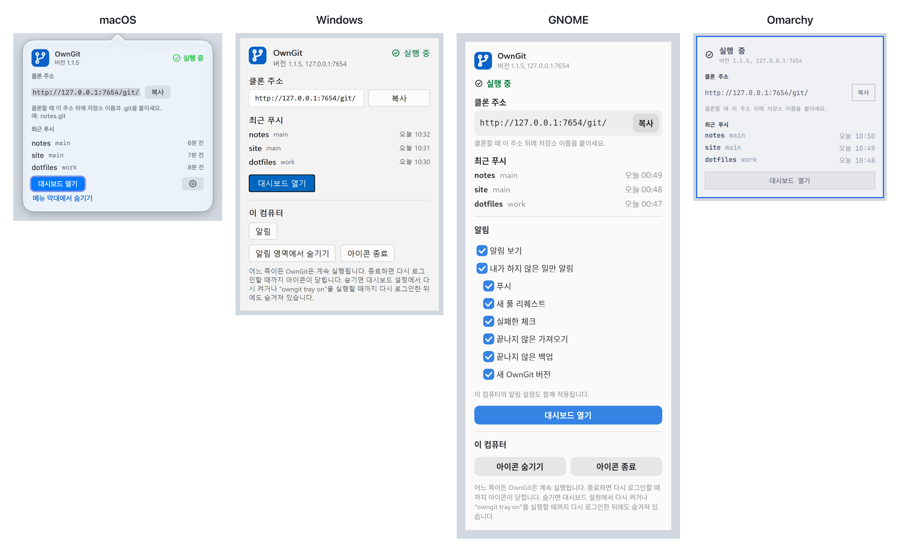
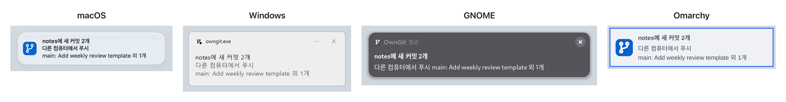

<p align="center">
  
</p>

<h1 align="center">OwnGit</h1>

<p align="center">
  <a href="CHANGELOG.md"></a>
  <a href="LICENSE"></a>
  <a href="https://github.com/juliankang4/homebrew-tap"></a>
  <a href="https://www.npmjs.com/package/owngit"></a>
</p>

<p align="center"><a href="README.md">English</a> | <b>한국어</b></p>

OwnGit은 혼자 또는 작은 그룹이 쓰는 셀프 호스팅 Git 서버(self-hosted Git server)입니다. 비공개 저장소를 내 컴퓨터, NAS, 홈 서버에 두고 브라우저 대시보드로 관리합니다. 클라우드 계정이나 구독은 필요 없습니다.

명령 하나로 설치하고, 명령이 출력한 설정 링크를 열면 됩니다.


## 주요 기능

- 어떤 Git 클라이언트로든 HTTP로 클론, 페치, 푸시를 합니다. 저장소는 평범한 bare Git 저장소입니다.
- 파일, 커밋, diff, 브랜치, 태그를 둘러보고 ZIP이나 tar.gz로 내려받습니다.
- 풀 리퀘스트를 브라우저나 명령줄에서 열고 리뷰하고 병합합니다. 그냥 `git push`할 때는 풀 리퀘스트가 필요 없습니다.
- 강제 푸시, 가져오기, 삭제로 사라질 기록을 보관합니다. 파일은 브라우저에서 되돌릴 수 있습니다.
- 저장소와 OwnGit 기록을 예약에 따라 또는 원할 때 백업하고 복원합니다.
- 다른 HTTPS Git 호스트의 저장소를 가져와 최신으로 유지합니다.
- 저장소 하나를 읽기 전용 링크로 공유합니다. 링크는 언제든 폐기할 수 있습니다.
- 프로젝트 체크를 기록하고 실행합니다. JSON 명령이나 MCP로 코딩 도구도 연결합니다.
- Go 프로그램 하나와 SQLite 파일 하나로 동작합니다. 따로 돌릴 데이터베이스 서비스가 없습니다.
- 영어와 한국어 화면, 라이트, 다크, 시스템 화면 모드를 지원합니다.

## 설치

Linux(x64, ARM64)와 macOS(Apple silicon)에서는 다음을 실행합니다.

```sh
/usr/bin/curl --proto '=https' --proto-redir '=https' -fsSL https://owngit.app/install.sh | /bin/sh
```

Windows(x64)에서는 PowerShell에서 실행합니다.

```powershell
irm -MaximumRedirection 0 https://owngit.app/install.ps1 | iex
```

설치 프로그램은 내려받은 파일을 릴리스의 `SHA256SUMS`와 대조하고, `owngit`을 설치해 서비스로 실행한 다음 설정 링크를 출력합니다.

다른 설치 방법:

| 방법 | 명령 |
| --- | --- |
| Homebrew(macOS, Linux) | `brew install juliankang4/tap/owngit` |
| npm(Node.js 필요) | `npm install -g owngit` |
| Arch Linux | [최신 릴리스](https://github.com/juliankang4/owngit/releases/latest)의 `PKGBUILD`로 `makepkg -si` |
| Docker Compose | [`compose.yaml`](packaging/container/compose.yaml)을 두고 `docker compose up -d`, 이어서 `docker compose exec -it owngit owngit setup-link` |
| Proxmox VE 호스트(root로) | `/usr/bin/curl --proto '=https' --proto-redir '=https' -fsSL https://owngit.app/proxmox.sh \| /bin/sh` |
| 소스(Go 1.27 이상) | `go build -o bin/owngit ./cmd/owngit` |

컨테이너와 Proxmox VE를 빼면, 컴퓨터에 `git-http-backend`가 들어 있는 Git이 있어야 합니다. Homebrew와 Arch 패키지는 Git을 함께 설치합니다. Windows에서 npm으로 설치할 때는 명령 프롬프트를 쓰세요. PowerShell의 기본 정책이 npm 스크립트를 막습니다.

방법별 자세한 내용은 [운영 안내](docs/OPERATIONS.ko.md)에 있습니다.

## 빠른 시작

1. OwnGit을 자동으로 시작하는 서비스로 실행합니다(한 줄 설치 프로그램을 썼다면 이미 끝난 단계입니다):

   ```sh
   owngit service install
   ```

2. 명령이 출력한 설정 링크를 엽니다. 여기서 저장소 폴더와 비밀번호를 정합니다. 링크는 15분 안에 한 번만 쓸 수 있습니다. 새 링크는 `owngit setup-link`로 받습니다.
3. 대시보드에서 저장소를 만들고 클론합니다. 주소는 예를 들어 `http://127.0.0.1:7654/git/project.git`입니다.

화면이 있는 컴퓨터에서는 OwnGit이 그 컴퓨터에서 오는 연결만 받습니다. 화면이 없는 서버에서는 다른 기기에서 설정을 마칠 수 있도록 모든 주소에서 연결을 받습니다. 설정을 마칠 때까지는 설정 페이지만 보여 줍니다.

서비스 대신 터미널에서 실행하려면 `owngit serve`를 씁니다.

잘 안 되면 `owngit doctor`를 실행하세요. 찾은 문제와 고치는 명령을 알려 줍니다.

### OwnGit 아이콘

데스크톱에서는 서비스가 메뉴 막대, 알림 영역, 패널에 OwnGit 아이콘도 띄웁니다. 아이콘에서 상태, 클론 주소, 최근 푸시를 보고 대시보드를 엽니다. GNOME에서는 AppIndicator 확장이 있어야 보입니다.

<picture>
  <source media="(prefers-color-scheme: dark)" srcset="docs/images/tray-panels.ko.dark.png">
  
</picture>

아이콘은 푸시, 새 풀 리퀘스트, 실패한 체크, 정상적으로 끝나지 않은 가져오기와 백업, 새 릴리스를 데스크톱 알림으로도 알려 줍니다.

<picture>
  <source media="(prefers-color-scheme: dark)" srcset="docs/images/push-notifications.ko.dark.png">
  
</picture>

## 업데이트와 제거

OwnGit은 스스로 업데이트하지 않습니다. 새 릴리스가 나오면 대시보드에 설치 방법에 맞는 업데이트 명령이 나옵니다. `owngit update`도 같은 명령을 출력합니다.

`owngit uninstall`은 서비스를 지웁니다. 저장소와 설정은 그대로 남습니다. 명령은 저장소와 설정의 위치, 그리고 프로그램을 지우는 방법을 알려 줍니다.

## 접근과 보안

- 저장소 접근은 비밀번호 없이 열어 두거나 공용 비밀번호 하나로 보호합니다. 사용자 계정은 없습니다. 열어 두면 네트워크의 모든 기기와 프로그램을 비롯해 OwnGit에 접속할 수 있는 누구나 읽기, 푸시, 브랜치와 태그 삭제, 저장소 만들기, 풀 리퀘스트 열기와 병합, 파일 복원을 할 수 있습니다. 믿기 어려운 기기나 사람이 있는 네트워크라면 공용 비밀번호를 고르세요.
- 설정, 저장소 삭제, 이름 변경, 가져오기, 체크 정책은 별도의 관리자 비밀번호로 보호합니다. 설정 화면의 접근 권한 탭에서 확인을 줄이거나 끈 경우는 예외입니다.
- OwnGit은 암호화하지 않은 HTTP로 응답합니다. 다른 기기에서는 Tailscale(`owngit tailscale on`)이나 리버스 프록시로 HTTPS를 쓰세요. LAN에서 HTTP를 그대로 쓰려면 직접 동의해야 합니다.
- OwnGit을 공개 인터넷에 열지 마세요. 공유 링크에만 응답하는 공개 주소는 선택해서 둘 수 있습니다.
- OwnGit은 하루에 한 번 GitHub에 새 릴리스가 있는지 묻습니다. 저장소 데이터는 보내지 않습니다. 설정 화면에서 끄거나 `--no-update-check`로 시작하면 묻지 않습니다.

취약점은 [SECURITY.ko.md](SECURITY.ko.md)에 적힌 방법으로 알려 주세요.

## 제한

- 실수로 푸시한 비밀값은 보관된 기록과 백업에 남습니다. 그 비밀값은 새것으로 바꾸세요.
- 보관된 기록은 백업이 아닙니다. 예약 백업은 백업 폴더를 정해야 시작됩니다.
- 호스트나 러너에서 실행하는 체크는 그 계정의 권한으로 샌드박스 없이 돌아갑니다.
- Git LFS 객체는 호스팅하지도 가져오지도 않습니다.
- 풀 리퀘스트를 병합하려면 서버에 Git 2.38 이상이 있어야 합니다.

## 문서

- [운영 안내](docs/OPERATIONS.ko.md): 설치, 설정, 서비스, 다른 기기에서 접속, 설정 화면
- [저장소](docs/REPOSITORIES.ko.md): 이름 바꾸기, 공유, 삭제, 가져오기
- [백업](docs/BACKUPS.ko.md): 저장 공간, 백업, 복원
- [코딩 도구](docs/CODING_TOOLS.ko.md): 명령줄과 MCP로 다루는 풀 리퀘스트와 체크
- [자동 체크](docs/AUTOMATIC_CHECKS.ko.md): 호스트, Docker, 러너에서 돌리는 체크
- [기여 안내](CONTRIBUTING.md)와 [변경 기록](CHANGELOG.md)

## 라이선스

[GPL-3.0-or-later](LICENSE). 1.1.4 이하 버전은 MIT 라이선스로 배포되었습니다. 서드파티 코드의 고지는 [THIRD_PARTY_NOTICES](THIRD_PARTY_NOTICES/README.md)에 있습니다.
