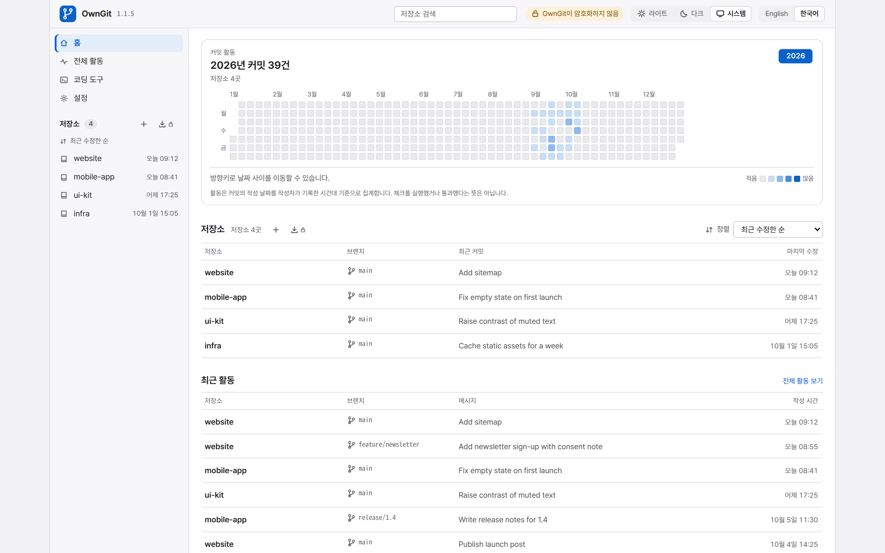

<p align="center">
  
</p>

<h1 align="center">OwnGit</h1>

<p align="center">
  <a href="CHANGELOG.md"></a>
  <a href="CHANGELOG.md"></a>
  <a href="LICENSE"></a>
  <a href="https://github.com/juliankang4/homebrew-tap"></a>
  <a href="https://www.npmjs.com/package/owngit"></a>
  <a href="https://go.dev"></a>
  <a href="https://www.sqlite.org"></a>
</p>

<p align="center"><a href="README.md">English</a> | <b>한국어</b></p>

OwnGit은 혼자 또는 작은 그룹이 쓰는 셀프 호스팅 Git 서버(self-hosted Git server)입니다. 비공개 저장소와 그 기록을 내 컴퓨터, NAS, 홈 서버에 두고 평소 작업은 브라우저 대시보드에서 합니다. 저장소는 컴퓨터에 이미 설치된 Git이 제공하는 평범한 bare Git 저장소 그대로입니다. 클라우드 Git 계정이나 구독도 필요 없습니다.

써 보려면 [설치](#설치) 방법을 하나 골라 설치한 뒤 [빠른 시작](#빠른-시작)을 따라 하세요. 설정은 터미널이나 브라우저에서 진행합니다.



## 주요 기능

- 일반 Git 클라이언트에서 Smart HTTP로 clone, fetch, push를 합니다.
- 저장소, 브랜치, 태그, 파일, 커밋, diff, 커밋 활동, 저장소에 쓰인 언어를 브라우저에서 봅니다. Git 2.40 이상이면 언어 통계가 `.gitattributes`의 Linguist 속성을 따릅니다.
- 브랜치, 태그, 커밋을 브라우저나 `curl`로 ZIP 또는 tar.gz 압축 파일로 내려받습니다.
- 풀 리퀘스트를 브라우저나 JSON CLI 명령으로 열고 리뷰하고 병합합니다. 병합은 화면에 보이는 바로 그 리비전으로 합니다. 풀 리퀘스트 없이 평소처럼 `git push`해도 됩니다.
- Tailscale Serve(설정 화면이나 `owngit tailscale on`으로 켭니다)나 Caddy, nginx, Traefik 같은 리버스 프록시를 거쳐 다른 기기에서 HTTPS로 접속합니다. [tailnet에서 HTTPS로 공유하기](docs/OPERATIONS.ko.md#tailnet에서-https로-공유하기)와 [리버스 프록시 뒤에서 운영하기](docs/OPERATIONS.ko.md#리버스-프록시-뒤에서-운영하기)를 참고하세요.
- 강제 푸시나 가져오기로 덮어쓰거나 삭제한 기록을 보관합니다(기본값은 보관이며 저장소마다 바꿀 수 있습니다). 바뀌는 내용을 모두 미리 본 뒤 브라우저에서 트리 전체나 고른 파일을 되돌릴 수 있습니다. 기본 브랜치를 다시 쓰거나 지우지 못하게 보호할 수도 있습니다.
- 저장소, 풀 리퀘스트 기록, 체크 기록, 가져오기 기록, 다른 서버로 옮길 수 있는 설정을 OwnGit이 실행 중일 때 예약에 따라 또는 원할 때 바로 백업하고 복원합니다. [백업](docs/OPERATIONS.ko.md#백업)을 참고하세요.
- 다른 HTTPS Git 호스트에서 저장소를 가져오고 필요할 때나 예약한 시각에 새로 고칩니다. 원본에는 아무것도 쓰지 않습니다.
- `owngit` 명령(체크 에이전트)이 사용자 환경에서 실행한 체크 결과를 기록하고 소유자가 켠 체크를 호스트, 제한된 로컬 Docker, 별도 러너에서 실행합니다. [자동 체크](docs/AUTOMATIC_CHECKS.ko.md)를 참고하세요. 체크와 리뷰는 참고용이며 병합을 막지 않습니다.
- 코딩 도구를 연결합니다. `owngit repo`, `owngit pr`, `owngit check`는 결과를 JSON으로 출력하고 `owngit mcp`는 MCP를 지원하는 도구에 같은 명령을 제공합니다. [코딩 도구 연동](docs/CODING_TOOLS.ko.md)을 참고하세요.
- Go 실행 파일 하나와 같은 컴퓨터에 있는 SQLite 데이터베이스로 동작합니다. 따로 돌려야 하는 데이터베이스 서비스는 없습니다.
- 영어와 한국어 화면을 제공하며 라이트, 다크, 시스템 화면 모드를 지원합니다.

## 설치

컨테이너를 빼면 어느 방법으로 설치하든 호스트에 실행 가능한 `git-http-backend`가 들어 있는 Git이 필요합니다. Homebrew, Arch Linux 패키지, Proxmox VE 도우미 스크립트는 Git을 함께 설치하고 컨테이너 이미지에는 Git이 들어 있습니다. 가장 빠른 방법은 한 줄 설치입니다. 다른 방법은 그 아래에 있습니다.

### 한 줄 설치

설치 스크립트는 이 컴퓨터에 맞는 최신 릴리스를 내려받아 같은 릴리스의 `SHA256SUMS`와 대조한 뒤 `owngit`을 설치하고 `owngit service install`로 서비스를 시작합니다. 터미널에서 실행했다면 마지막에 설정 링크를 출력합니다.

Linux(x64, ARM64)와 macOS(Apple silicon)에서는 다음과 같이 실행합니다.

```sh
/usr/bin/curl --proto '=https' --proto-redir '=https' -fsSL https://owngit.app/install.sh | /bin/sh
```

Windows(x64)에서는 PowerShell에서 실행합니다.

```powershell
irm -MaximumRedirection 0 https://owngit.app/install.ps1 | iex
```

버전 고정, 서비스 없이 설치하기 같은 옵션과 프로그램을 두는 위치는 [한 줄 설치](docs/OPERATIONS.ko.md#한-줄-설치)에 있습니다.

### Homebrew, npm, Arch Linux

macOS(Apple silicon)나 Linux(x64, ARM64)에서는 [Homebrew](https://brew.sh)로 설치합니다.

```sh
brew install juliankang4/tap/owngit
```

macOS(Apple silicon), Linux(x64, ARM64), Windows(x64)에서는 [npm](https://www.npmjs.com/package/owngit)으로도 설치할 수 있습니다. 이 방법은 설치할 때와 OwnGit을 시작할 때 Node.js가 필요합니다.

```sh
npm install -g owngit
```

Windows PowerShell의 기본 실행 정책은 npm이 PowerShell 스크립트로 설치하는 `npm`과 `owngit` 명령을 막습니다. 명령 프롬프트(cmd.exe)에서 실행하거나, `Set-ExecutionPolicy -Scope CurrentUser RemoteSigned`로 내 계정에서 로컬 스크립트를 한 번 허용하세요.

Arch Linux(x64, ARM64)나 Omarchy에서는 각 릴리스에 첨부된 `PKGBUILD`로 패키지를 만들어 설치합니다. `makepkg`가 릴리스 압축 파일을 내려받아 SHA-256을 확인하고 `pacman`으로 `owngit-bin` 패키지를 설치합니다. `base-devel` 그룹이 필요합니다.

```sh
mkdir owngit-bin && cd owngit-bin
curl -fLO https://github.com/juliankang4/owngit/releases/latest/download/PKGBUILD
makepkg -si
```

### 릴리스 압축 파일이나 소스

[GitHub Releases](https://github.com/juliankang4/owngit/releases)에서 플랫폼에 맞는 압축 파일을 내려받아 `SHA256SUMS`로 확인해도 됩니다. macOS 실행 파일은 서명되어 있고 Apple의 공증을 받았습니다. Linux와 Windows 실행 파일에는 서명이 없습니다.

소스에서 빌드하려면 Go 1.27 이상이 필요합니다.

```sh
git clone https://github.com/juliankang4/owngit.git
cd owngit
go build -o bin/owngit ./cmd/owngit
```

### 컨테이너

컨테이너 이미지로 Docker Engine과 Docker Compose가 있는 Linux(x64, ARM64)에서 OwnGit을 실행할 수 있습니다. [`packaging/container/compose.yaml`](packaging/container/compose.yaml)을 새 폴더에 저장하고 그 폴더에서 OwnGit을 시작한 뒤 설정 링크를 출력하세요.

```sh
docker compose up -d
docker compose exec -it owngit owngit setup-link
```

Docker가 OwnGit을 백그라운드에서 계속 실행하므로 [빠른 시작](#빠른-시작)의 `owngit service install`은 건너뜁니다. 설정 링크는 컨테이너를 실행하는 컴퓨터의 브라우저에서 여세요. 다른 기기에서 열 때는 링크의 `localhost` 자리에 그 컴퓨터의 이름이나 주소를 넣습니다. 링크는 15분 안에 한 번만 쓸 수 있고 두 번째 명령을 다시 실행하면 새 링크가 나옵니다.

데이터 위치, 업데이트, 백업, 컨테이너에서 로그인이 동작하는 방식, 다른 계정으로 실행하는 방법은 [컨테이너로 실행하기](docs/OPERATIONS.ko.md#컨테이너로-실행하기)에 있습니다.

### Proxmox VE

Proxmox VE 호스트에서는 도우미 스크립트가 권한 없는(unprivileged) Debian 13 컨테이너를 만들고 한 줄 설치 스크립트로 그 안에 OwnGit을 설치합니다. OwnGit은 호스트와 함께 시작하는 서비스로 실행됩니다. Proxmox 웹 화면에 있는 노드의 Shell처럼 호스트의 셸에서 root로 다음을 실행하세요.

```sh
/usr/bin/curl --proto '=https' --proto-redir '=https' -fsSL https://owngit.app/proxmox.sh | /bin/sh
```

터미널에서 실행하면 스크립트가 마지막에 설정 링크를 보여 줍니다. OwnGit 릴리스에서 받은 것은 호스트에서 하나도 실행하지 않습니다. 중간에 실패하면 스크립트가 이번에 만든 컨테이너를 지웁니다.

저장소를 호스트의 폴더에 두는 방법 같은 옵션, 컨테이너 안에서 OwnGit 명령을 실행하는 방법, 업데이트 방법은 [Proxmox VE에서 실행하기](docs/OPERATIONS.ko.md#proxmox-ve에서-실행하기)에 있습니다.

### 업데이트와 제거

OwnGit은 스스로 업데이트하지 않습니다. 새 릴리스가 나오면 관리자로 확인한 사람에게 대시보드가 설치한 방법에 맞는 업데이트 명령을 복사 버튼과 함께 보여 줍니다. `owngit update`도 같은 명령을 출력합니다.

| 설치한 방법 | 명령 |
| --- | --- |
| Homebrew | `brew upgrade owngit` |
| npm | `npm install -g owngit@X.Y.Z` |
| Arch Linux `PKGBUILD`(`owngit-bin`) | 새 릴리스의 `PKGBUILD`를 `makepkg -si`로 빌드합니다 |
| 릴리스 압축 파일이나 한 줄 설치 | 새 릴리스의 설치 스크립트를 실행합니다. 스크립트는 압축 파일을 `SHA256SUMS`와 대조한 뒤 그 안의 `owngit`으로 지금 파일을 바꿉니다. Windows에서는 새 릴리스를 지금 폴더 옆의 새 폴더에 풉니다 |
| Proxmox VE 도우미 스크립트 | 위의 설치 스크립트 명령을 컨테이너의 셸(`pct enter ID`)에서 실행합니다. 명령은 `pct exec ID -- /usr/local/bin/owngit update`로 볼 수 있습니다 |
| 컨테이너 이미지 | `compose.yaml`이 있는 폴더에서 `docker compose pull && docker compose up -d`를 실행합니다. 새 이미지로 컨테이너를 다시 만들고 데이터 볼륨은 그대로 둡니다 |

서비스가 이 OwnGit을 실행하고 있으면 명령이 `owngit service install`도 실행해 서비스를 새 버전으로 다시 시작합니다.

`owngit uninstall`은 `owngit service install`이 만든 것, 곧 서비스와 Windows의 Program Files 안 복사본을 지웁니다. 상태와 저장소는 그대로 두고 위치를 알려 줍니다. 프로그램 파일은 그 파일을 설치한 쪽의 몫이라 지우지 않고 마지막에 지우는 명령을 알려 줍니다. `brew uninstall owngit`, `npm uninstall -g owngit`, `sudo pacman -R owngit-bin` 가운데 하나이거나, 압축 파일로 설치했다면 지울 파일입니다. 컨테이너에서는 `docker compose down`을 알려 줍니다. 이 명령은 컨테이너를 지우고 데이터 볼륨은 남깁니다. 자세한 내용은 [업데이트와 제거](docs/OPERATIONS.ko.md#업데이트와-제거)를 보세요.

## 빠른 시작

OwnGit을 백그라운드에서 돌고 알아서 다시 켜지는 서비스로 설치합니다. Linux, macOS, Windows에서 모두 됩니다.

```sh
owngit service install
```

명령은 마지막에 한 번만 쓰는 설정 링크를 출력합니다. (한 줄 설치 스크립트로 설치했다면 스크립트가 이 명령을 이미 실행해 링크까지 출력했습니다.) 브라우저에서 링크를 열고 저장소 폴더와 비밀번호를 정하세요. 링크는 15분 안에 한 번만 쓸 수 있습니다. 새 링크는 `owngit setup-link`로 받을 수 있습니다.

명령은 거의 아무것도 묻지 않습니다. 예외는 두 가지입니다. SSH로 접속한 Linux 컴퓨터에서는 `sudo` 비밀번호를 묻고 Windows 관리자 계정에서는 사용자 계정 컨트롤 승인을 한 번 묻습니다(이때 Git이 없으면 `winget`으로 함께 설치합니다). OwnGit이 어디서 응답하는지는 컴퓨터에 따라 다릅니다.

- 데스크톱에서는 OwnGit이 내 사용자 계정으로 돌고 이 컴퓨터(`http://127.0.0.1:7654`)에서만 응답합니다.
- SSH로 접속하는 서버나 컨테이너처럼 화면이 없는 컴퓨터에서는 모든 주소에서 연결을 받고 다른 기기에서 열 수 있도록 링크에 이 컴퓨터의 LAN이나 tailnet 주소를 넣습니다. 설정을 마치기 전까지 그 주소는 설정 페이지에만 응답합니다. 공인 주소만 있는 서버에서는 SSH 터널 명령을 대신 출력합니다.
- Homebrew로 설치했다면 서비스를 `brew services`에 맡기며 로그는 `$(brew --prefix)/var/log/owngit.log`에 남습니다.

시스템마다 누가 서비스를 실행하는지, 서비스를 업데이트하고 멈추고 지우는 방법은 [서비스로 실행하기](docs/OPERATIONS.ko.md#서비스로-실행하기)에 있습니다. Windows의 승인이 하는 일은 [Windows에서](docs/OPERATIONS.ko.md#windows에서)를 보세요.

Windows에서는 이 명령이 알림 영역에 OwnGit 아이콘도 놓습니다. 클릭하면 대시보드가 열리고, 오른쪽 클릭하면 상태, 클론 주소, 최근 푸시가 보입니다. [Windows의 아이콘](docs/OPERATIONS.ko.md#windows의-아이콘)을 참고하세요.

데스크톱이 있는 Mac에서는 이 명령이 메뉴 막대에 OwnGit 아이콘도 열고, 그 뒤로는 로그인할 때마다 아이콘이 열립니다. 클릭하면 상태, 클론 주소, 최근 푸시, 대시보드가 보입니다. 아이콘을 숨기거나 종료해도 OwnGit은 멈추지 않습니다. [macOS의 아이콘](docs/OPERATIONS.ko.md#macos의-아이콘)을 참고하세요.

Linux 데스크톱에서는 이 명령이 패널에 OwnGit 아이콘도 띄우고 그 뒤로는 로그인할 때마다 아이콘이 시작됩니다. 아이콘을 열면 상태, 클론 주소, 최근 푸시가 보입니다. GNOME에서는 AppIndicator 확장이 있어야 아이콘이 보입니다. [Linux의 아이콘](docs/OPERATIONS.ko.md#linux의-아이콘)을 참고하세요.

### 터미널에서 실행하기

서비스 대신 터미널에서 바로 실행하려면 다음 명령을 씁니다.

```sh
owngit serve
```

소스에서 빌드했다면 `./bin/owngit serve`로 실행합니다. 압축 파일을 풀었다면 그 폴더에서 `./owngit serve`로 실행합니다(Windows 명령 프롬프트에서는 `owngit serve`).

터미널에서 처음 실행하면 설정도 그 터미널에서 진행합니다. English나 한국어를 고른 뒤 "이 터미널에서 계속"과 "웹 대시보드 열기" 중 하나를 고릅니다. 웹 대시보드를 고르면 브라우저에 짧은 코드가 나오며 터미널에도 같은 코드가 보이면 터미널에서 그 브라우저를 승인합니다.

터미널 없이 시작하면 OwnGit은 상태 디렉터리 안에 소유자만 읽을 수 있는 설정 파일을 만들고 로그에 파일 경로를 남깁니다. 화면이 보이는 데스크톱 세션에서 `--no-open` 없이 시작했다면 그 파일을 브라우저에서도 엽니다. OwnGit 서비스는 모두 `--no-open`으로 시작합니다. 그 밖의 경우에는 이 컴퓨터의 브라우저에서 그 파일을 직접 열거나 `owngit setup-link`로 새 링크를 받으세요. 링크 자체는 로그에 남지 않습니다. 자세한 내용은 [처음 설정하기](docs/OPERATIONS.ko.md#처음-설정하기)를 보세요.

### 첫 저장소

대시보드에서 저장소를 만든 뒤 그 clone 주소(예: `http://127.0.0.1:7654/git/project.git`)를 아무 Git 클라이언트에서나 쓰면 됩니다. 다른 기기에서 접속하기, 기존 저장소 옮기기, 복구, 백업은 [운영 안내](docs/OPERATIONS.ko.md)에서 설명합니다. 잘 되지 않으면 `owngit doctor`가 이 컴퓨터에서 찾은 문제와 고치는 명령을 알려 줍니다.

## 자원 사용량

OwnGit은 약 30 MB짜리 프로그램 하나(내려받는 크기는 18 MB)이고, 컴퓨터에 이미 있는 Git을 함께 씁니다. 아래 표는 OwnGit 1.1.0을 설정한 뒤 아무도 쓰지 않는 상태에서 메모리가 안정된 다음 잰 값입니다.

| | Linux x64 | macOS (Apple silicon) |
| --- | --- | --- |
| 메모리, 저장소 없음 | 약 45 MB | 약 35 MB |
| 메모리, 작은 저장소 100개 | 약 50 MB | 약 50 MB |
| CPU | 코어 하나의 0.1% 미만 | 코어 하나의 0.1% 미만 |

비밀번호를 확인할 때마다 Argon2id 계산 때문에 메모리를 잠깐 70 MB쯤 더 씁니다. 비밀번호를 정하거나 로그인할 때, 관리자 비밀번호로 변경을 확인할 때, 그리고 공용 비밀번호를 정해 두었다면 Git과 API 요청에서 확인합니다. 공용 비밀번호는 한 번 확인하면 5분 동안 다시 계산하지 않으므로 클론이나 푸시 한 번에 확인도 한 번입니다. 한 번에 최대 네 개까지 확인하고 쓴 메모리는 몇 분 뒤 돌려줍니다. 클론이나 푸시를 할 때는 Git도 실행되며, Git이 쓰는 메모리는 저장소에 따라 다릅니다.

Linux의 메모리 값은 `/proc`과 `ps`가 보고하는 상주 메모리(RSS)이고, macOS의 값은 활동 모니터의 메모리 열입니다. macOS는 OwnGit이 돌려준 메모리를 한동안 붙들고 있어서 `ps`에는 120 MB쯤으로 보일 수 있습니다.

## 접근과 보안

- 화면이 있는 컴퓨터에서는 OwnGit이 기본적으로 그 컴퓨터에서만 응답합니다. SSH로 접속하는 서버나 컨테이너처럼 화면이 없는 컴퓨터에서는 다른 기기에서 설정을 마칠 수 있도록 처음부터 모든 주소에서 연결을 받습니다. 설정을 마치기 전까지는 한 번만 쓰는 설정 링크에만 응답합니다.
- 일반 저장소 접근은 비밀번호 없이 열어 두거나 공용 비밀번호 하나로 보호할 수 있습니다. 개인 계정은 없습니다.
- 보안 설정은 별도의 관리자 비밀번호로 보호합니다. 대시보드는 기본적으로 30분이 지나면 이 비밀번호를 다시 묻습니다. 설정의 접근 권한 탭에서 매번 묻게 하거나, 한 브라우저에서 최대 30일까지 기억하게 하거나, 확인을 끌 수 있습니다.
- 설정을 마친 뒤 OwnGit은 하루에 한 번 GitHub에 새 릴리스가 있는지 확인하고 대시보드에 알림을 보여 줍니다. 저장소 데이터는 보내지 않으며 스스로 업데이트하지 않습니다. 설정 화면에서 끄거나, `--no-update-check`로 시작하면 릴리스 확인을 아예 하지 않습니다. 자세한 내용은 [새 릴리스 알림](docs/OPERATIONS.ko.md#새-릴리스-알림)을 보세요.
- OwnGit은 암호화되지 않은 일반 HTTP로 동작하며 TLS를 내장하지 않습니다. 암호화는 이 컴퓨터의 Tailscale([tailnet에서 HTTPS로 공유하기](docs/OPERATIONS.ko.md#tailnet에서-https로-공유하기) 참고)이나 OwnGit 앞에 둔 리버스 프록시가 맡습니다. 프록시가 보낸 전달 헤더는 사용자가 그 프록시를 지정했을 때만 믿습니다([리버스 프록시 뒤에서 운영하기](docs/OPERATIONS.ko.md#리버스-프록시-뒤에서-운영하기) 참고). LAN의 다른 기기에서 일반 HTTP로 접속하려면 설정 과정이나 설정 화면의 네트워크 탭에서 그 위험을 받아들인다고 직접 확인해야 합니다. 페이지 머리글에는 연결이 암호화되었는지 늘 표시됩니다. 다른 기기에서 접속할 때는 Tailscale이나 직접 운영하는 VPN을 쓰는 편이 좋습니다. 공개 인터넷에서 운영하는 용도는 지원 범위가 아닙니다.

## 현재 상태와 제한

- 기본 설정에서는 강제 푸시나 가져오기, 브랜치 삭제가 일어나도 이전 커밋이 보관된 기록에 남습니다. 그래서 한 번 커밋한 비밀값은 OwnGit과 그 백업에 계속 남습니다. 보관하지 않음을 골라도 그 뒤의 기록을 보관하지 않을 뿐, 이미 보관된 기록은 지워지지 않습니다. 이 기록을 지우는 방법은 저장소를 파일째 삭제하는 것뿐이고, 그 전에 만든 백업에는 여전히 들어 있습니다. 실수로 푸시한 비밀값은 새것으로 교체하세요.
- 보관된 기록은 백업이 아닙니다. 예약 백업은 `owngit backup schedule set`으로 백업 폴더를 정한 뒤에야 시작됩니다.
- 호스트와 러너의 체크 명령은 해당 계정의 권한으로 실행되며 샌드박스로 격리되지 않습니다.
- OwnGit은 다른 도구가 보낸 리뷰 라벨과 체크 결과를 기록할 뿐, 리뷰어나 코딩 에이전트를 직접 실행하지 않습니다.
- Git LFS 객체는 호스팅하거나 가져오지 않습니다.
- 풀 리퀘스트를 병합하려면 OwnGit 호스트에 Git 2.38 이상이 필요합니다.

## 라이선스

OwnGit 소스는 [MIT 라이선스](LICENSE)로 이용할 수 있습니다. 실행 파일에 포함된 제3자 코드와 자산의 고지는 [THIRD_PARTY_NOTICES](THIRD_PARTY_NOTICES/README.md)에 있습니다.

## 문서

기여 안내와 변경 기록은 영어로만 되어 있습니다.

- [운영 안내](docs/OPERATIONS.ko.md): 초기 설정, 접근, 복구, 저장소 옮기기, 가져오기, 풀 리퀘스트, 체크, 저장 공간, 백업
- [자동 체크](docs/AUTOMATIC_CHECKS.ko.md): 호스트, 제한된 Docker, 별도 러너에서 실행하는 체크
- [코딩 도구](docs/CODING_TOOLS.ko.md): 명령줄이나 MCP로 코딩 도구를 연결하고 프로젝트 체크를 기록하는 방법
- [기여 안내](CONTRIBUTING.md): OwnGit을 빌드하고 테스트해서 변경 사항을 보내는 방법
- [변경 기록](CHANGELOG.md): 버전별 주요 변경 사항
- [보안 정책](SECURITY.ko.md): 취약점을 비공개로 신고하는 방법
