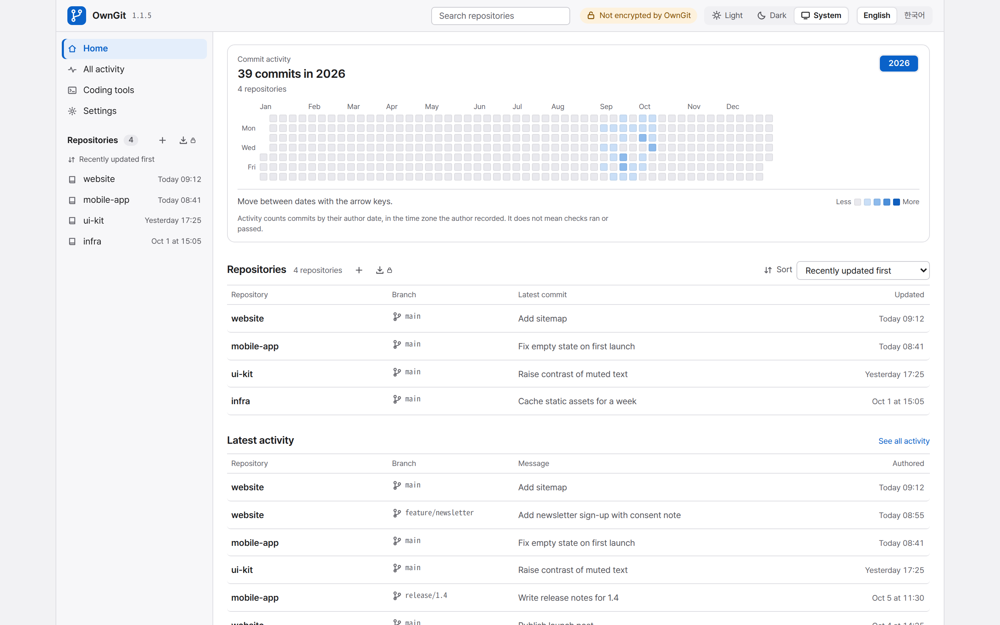

<p align="center">
  
</p>

<h1 align="center">OwnGit</h1>

<p align="center">
  <a href="CHANGELOG.md"></a>
  <a href="CHANGELOG.md"></a>
  <a href="LICENSE"></a>
  <a href="https://github.com/juliankang4/homebrew-tap"></a>
  <a href="https://www.npmjs.com/package/owngit"></a>
  <a href="https://go.dev"></a>
  <a href="https://www.sqlite.org"></a>
</p>

<p align="center"><b>English</b> | <a href="README.ko.md">한국어</a></p>

OwnGit is a self-hosted Git server for one person or a small group. It keeps private repositories and their history on your own computer, NAS, or home server, and gives you a browser dashboard for everyday work. Repositories stay ordinary bare Git repositories, served by the Git already installed on the computer, and you need no cloud Git account or subscription.

To try it, pick an [install](#install) route and follow the [Quickstart](#quickstart). Setup runs in a terminal or in a browser.



## Features

- Clone, fetch, and push from any standard Git client over Smart HTTP.
- Browse repositories, branches, tags, files, commits, diffs, commit activity, and the languages each repository uses. With Git 2.40 or newer, language statistics follow Linguist attributes in `.gitattributes`.
- Download a branch, tag, or commit as a ZIP or tar.gz archive, from the browser or with `curl`.
- Open, review, and merge pull requests in the browser or from JSON CLI commands. A merge uses the exact revisions on screen, and a plain `git push` works without a pull request.
- Reach OwnGit from your other devices over HTTPS through Tailscale Serve (turned on in Settings or with `owngit tailscale on`) or a reverse proxy such as Caddy, nginx, or Traefik. See [Share on your tailnet over HTTPS](docs/OPERATIONS.md#share-on-your-tailnet-over-https) and [Behind a reverse proxy](docs/OPERATIONS.md#behind-a-reverse-proxy).
- Keep the history that a force-push, an import, or a deletion replaces (on by default, and adjustable per repository), and restore a whole tree or selected files from the browser after previewing every change. You can also protect the default branch from rewrites and deletion.
- Create and restore offline backups of repositories, pull request, check, and import records, and portable settings.
- Import a repository from another HTTPS Git host and refresh it on demand or on a schedule, without writing to the source.
- Record checks that the `owngit` command runs in your own environment, and run owner-enabled checks on the host, in restricted local Docker, or on a separate runner. See [Automatic checks](docs/AUTOMATIC_CHECKS.md). Checks and reviews are advisory and never hold a merge.
- Connect coding tools: `owngit repo`, `owngit pr`, and `owngit check` print JSON, and `owngit mcp` offers the same commands to tools that support MCP. See [Coding tool integration](docs/CODING_TOOLS.md).
- Run one Go executable with a SQLite database on the same computer. There is no database service to run.
- Use the interface in English or Korean, with Light, Dark, and System appearance modes.

## Install

Every route except the container needs Git with an executable `git-http-backend` on the host. Homebrew, the Arch Linux package and the Proxmox VE helper install Git for you, and the container image includes it. The one-line installer is the quickest route; the others follow.

### One-line installer

The installer downloads the latest release for this computer, checks it against the release's `SHA256SUMS`, installs `owngit`, and runs it as a service with `owngit service install`. Run from a terminal, it prints the setup link at the end.

On Linux (x64, ARM64) and macOS (Apple silicon):

```sh
/usr/bin/curl --proto '=https' --proto-redir '=https' -fsSL https://owngit.app/install.sh | /bin/sh
```

On Windows (x64), in PowerShell:

```powershell
irm -MaximumRedirection 0 https://owngit.app/install.ps1 | iex
```

[One-line installer](docs/OPERATIONS.md#one-line-installer) lists its options, such as a pinned version or no service, and where it puts the program.

### Homebrew, npm, and Arch Linux

With [Homebrew](https://brew.sh) on macOS (Apple silicon) or Linux (x64, ARM64):

```sh
brew install juliankang4/tap/owngit
```

With [npm](https://www.npmjs.com/package/owngit) on macOS (Apple silicon), Linux (x64, ARM64), or Windows (x64). This route needs Node.js to install and to start OwnGit:

```sh
npm install -g owngit
```

On Windows, PowerShell's default execution policy blocks the `npm` and `owngit` commands that npm installs as PowerShell scripts. Run them in Command Prompt (cmd.exe) instead, or allow local scripts for your account once with `Set-ExecutionPolicy -Scope CurrentUser RemoteSigned`.

On Arch Linux (x64, ARM64) or Omarchy, build the package from the `PKGBUILD` attached to each release. `makepkg` downloads the release archive, checks its SHA-256, and installs the package `owngit-bin` with `pacman`. It needs the `base-devel` group.

```sh
mkdir owngit-bin && cd owngit-bin
curl -fLO https://github.com/juliankang4/owngit/releases/latest/download/PKGBUILD
makepkg -si
```

### Release archive or source

You can also download the archive for your platform from [GitHub Releases](https://github.com/juliankang4/owngit/releases) and check it against `SHA256SUMS`. The macOS binary is signed and notarized by Apple; the Linux and Windows binaries are not signed.

To build from source with Go 1.27 or newer:

```sh
git clone https://github.com/juliankang4/owngit.git
cd owngit
go build -o bin/owngit ./cmd/owngit
```

### Container

The container image runs OwnGit on Linux (x64, ARM64) with Docker Engine and Docker Compose. Save [`packaging/container/compose.yaml`](packaging/container/compose.yaml) in a new folder. In that folder, start OwnGit and print the setup link:

```sh
docker compose up -d
docker compose exec -it owngit owngit setup-link
```

Docker keeps OwnGit running in the background, so this route skips `owngit service install` in the [Quickstart](#quickstart). Open the setup link in a browser on the computer that runs the container. From another device, put that computer's name or address in place of `localhost` in the link. The link works once, within 15 minutes; the second command prints a new one.

[Run in a container](docs/OPERATIONS.md#run-in-a-container) explains where the data lives, updates, backups, how sign-in works in a container, and running as another account.

### Proxmox VE

On a Proxmox VE host, a helper script creates an unprivileged Debian 13 container, installs OwnGit in it with the one-line installer, and runs it as a service that starts with the host. Run it as root in the host's shell, for example the node's Shell in the Proxmox web interface:

```sh
/usr/bin/curl --proto '=https' --proto-redir '=https' -fsSL https://owngit.app/proxmox.sh | /bin/sh
```

Run from a terminal, the script ends with the setup link. Nothing from the OwnGit release runs on the host itself, and a failed run removes the container it created.

[Run on Proxmox VE](docs/OPERATIONS.md#run-on-proxmox-ve) lists its options, such as keeping the repositories in a folder of the host, and explains how to run OwnGit's commands in the container and how to update it.

### Update and remove

OwnGit never updates itself. When a newer release exists, the dashboard shows a confirmed administrator the command that updates OwnGit the way it was installed, with a Copy button, and `owngit update` prints the same command:

| Installed with | The command |
| --- | --- |
| Homebrew | `brew upgrade owngit` |
| npm | `npm install -g owngit@X.Y.Z` |
| The Arch Linux `PKGBUILD` (`owngit-bin`) | builds the new release's `PKGBUILD` with `makepkg -si` |
| A release archive or the one-line installer | runs the new release's installer, which checks the archive against `SHA256SUMS` and puts its `owngit` in place of this one; on Windows it unpacks the new release into a folder beside the current one |
| The Proxmox VE helper | the installer command above, run in the container's shell (`pct enter ID`); `pct exec ID -- /usr/local/bin/owngit update` prints it |
| The container image | `docker compose pull && docker compose up -d`, run in the folder of `compose.yaml`; it recreates the container with the new image and keeps the data volume |

When a service runs this OwnGit, the command also runs `owngit service install`, which restarts the service with the new version.

`owngit uninstall` removes what `owngit service install` created: the service and, on Windows, the copy in Program Files. The state and the repositories stay, and the command says where they are. It does not remove the program files, which belong to whatever installed them. It ends by naming the command for that: `brew uninstall owngit`, `npm uninstall -g owngit`, `sudo pacman -R owngit-bin`, or, for an archive, the file to delete. In the container it names `docker compose down`, which removes the container and keeps the data volume. See [Update and uninstall](docs/OPERATIONS.md#update-and-uninstall).

## Quickstart

Install OwnGit as a service that runs in the background and starts again by itself. This works on Linux, macOS, and Windows:

```sh
owngit service install
```

The command prints a one-time setup link at the end. (If you used the one-line installer, it already ran this command and printed the link.) Open the link in a browser to choose the repository folder and the passwords. The link works once, within 15 minutes, and `owngit setup-link` prints a new one.

The command asks no questions, with two exceptions: on a Linux computer you reached over SSH it asks for your `sudo` password, and on a Windows administrator account it asks for one User Account Control approval (it then also installs Git with `winget` if Git is missing). Where OwnGit answers depends on the computer:

- On a desktop, OwnGit runs as your user and answers only on this computer, at `http://127.0.0.1:7654`.
- On a computer without a screen, such as a server or a container you reach over SSH, OwnGit listens on every address, and the link uses this computer's LAN or tailnet address so that you can open it on another device. Until setup is finished, that address answers only the setup page. A server with only a public address prints an SSH tunnel command instead.
- When Homebrew installed OwnGit, the command hands the service to `brew services`, whose log is `$(brew --prefix)/var/log/owngit.log`.

[Run as a service](docs/OPERATIONS.md#run-as-a-service) explains who runs the service on each system and how to update, stop, and remove it. [On Windows](docs/OPERATIONS.md#on-windows) explains what the approval does.

On Windows the command also puts the OwnGit icon in the notification area: click it for the dashboard, or right-click it for the status, the clone address and the latest pushes. See [The icon on Windows](docs/OPERATIONS.md#the-icon-on-windows).

On a Mac with a desktop the command also opens the OwnGit icon in the menu bar, which then opens whenever you sign in: click it for the status, the clone address, the latest pushes and the dashboard. Hiding or quitting the icon never stops OwnGit. See [The icon on macOS](docs/OPERATIONS.md#the-icon-on-macos).

On a Linux desktop the command also shows the OwnGit icon in the panel; click it for the status, the clone address and the latest pushes. See [The icon on Linux](docs/OPERATIONS.md#the-icon-on-linux).

### Run in the foreground

To run OwnGit in a terminal instead of as a service:

```sh
owngit serve
```

From a source build, run `./bin/owngit serve`. From an unpacked archive, run `./owngit serve` in its folder (in Windows Command Prompt, `owngit serve`).

The first start from a terminal runs setup there. Choose English or 한국어, then "Continue in this terminal" or "Open the web dashboard"; in the browser you get a short code to approve in the terminal.

When OwnGit starts without a terminal, it writes an owner-readable setup file in the state directory and logs the file's path. It also opens that file in your browser, unless it was started with `--no-open`, as every OwnGit service is. `owngit setup-link` prints a new link, and the link itself never reaches a log. See [First-time setup](docs/OPERATIONS.md#first-time-setup).

### First repository

Create a repository from the dashboard, then use its clone address, for example `http://127.0.0.1:7654/git/project.git`, with any Git client. [Operations](docs/OPERATIONS.md) covers access from other devices, moving existing repositories, recovery, and backups. When something does not work, `owngit doctor` names what it found on this computer and the command that fixes it.

## Resource use

OwnGit is one program of about 30 MB (an 18 MB download) plus the Git already on the computer. Measured with OwnGit 1.1.0 after setup, once memory had settled with nobody using it:

| | Linux x64 | macOS (Apple silicon) |
| --- | --- | --- |
| Memory, no repositories | about 45 MB | about 35 MB |
| Memory, 100 small repositories | about 50 MB | about 50 MB |
| CPU | under 0.1% of one core | under 0.1% of one core |

Checking a password briefly needs about 70 MB more, because passwords are hashed with Argon2id. That happens when you set a password, sign in, or confirm a change with the administrator password, and on Git and API requests when a shared access password is set. OwnGit then accepts the same shared password for five minutes without hashing it again, so one clone or push needs one check. It runs at most four checks at once and gives the memory back a few minutes later. Each clone or push also runs Git, whose memory depends on the repository.

On Linux, memory is the resident set size that `/proc` and `ps` report. On macOS it is the Memory column of Activity Monitor; `ps` can show about 120 MB there, because macOS holds on to memory that OwnGit gave back.

## Access and security

- On a computer with a screen, OwnGit answers only on that computer by default. A computer without one, such as a server reached over SSH or a container, listens on every address from the first start so that you can finish setup from another device, and until then answers only the one-time setup link.
- General repository access can be password-free or protected by one shared password. There are no individual accounts.
- A separate administrator password protects security settings. The dashboard asks for it again after 30 minutes by default; under Settings, Access you can make it ask every time, remember it for up to 30 days in one browser, or turn the check off.
- After setup, OwnGit asks GitHub once a day whether a newer release exists and shows a notice on the dashboard. It sends no repository data and never updates itself. Turn it off in Settings, or start with `--no-update-check` so it never checks. See [New-release notice](docs/OPERATIONS.md#new-release-notice).
- OwnGit serves plain HTTP, which is not encrypted, and has no built-in TLS. Encryption comes from Tailscale on this computer (see [Share on your tailnet over HTTPS](docs/OPERATIONS.md#share-on-your-tailnet-over-https)) or from a reverse proxy in front of OwnGit, whose forwarded headers OwnGit believes only when you configure it (see [Behind a reverse proxy](docs/OPERATIONS.md#behind-a-reverse-proxy)). Plain HTTP from another device on the LAN needs your explicit acceptance, which setup and the Settings Network tab ask for, and the page header always shows whether the connection is encrypted. Prefer Tailscale or your own VPN for other devices. Public Internet hosting is out of scope.

## Status and limits

- By default, a force-push, an import, or a branch deletion leaves the old commits in kept history, so a secret you committed stays in OwnGit and its backups. Choosing Do not keep only stops keeping later history and removes nothing already kept. Deleting the whole repository with its files is the only way to remove that history, and earlier backups still contain it. Rotate any secret you push by mistake.
- Kept history is not a backup. Backups run only when you start them.
- Host and runner check commands run with their account's permissions and are not sandboxes.
- OwnGit records review labels and check results that other tools supply, but it never runs reviewers or coding agents.
- Git LFS objects are not hosted or imported.
- Merging a pull request needs Git 2.38 or newer on the OwnGit host.

## License

OwnGit's source is available under the [MIT License](LICENSE). Notices for the third-party code and assets built into the executable are in [THIRD_PARTY_NOTICES](THIRD_PARTY_NOTICES/README.md).

## Documentation

- [Operations](docs/OPERATIONS.md): setup, access, recovery, moving repositories, imports, pull requests, checks, storage, and backups
- [Automatic checks](docs/AUTOMATIC_CHECKS.md): checks that run on the host, in restricted Docker, or on a separate runner
- [Coding tools](docs/CODING_TOOLS.md): connecting a coding tool through the command line or MCP, and recording project checks
- [Contributing](CONTRIBUTING.md): building, testing, and sending a change to OwnGit
- [Changelog](CHANGELOG.md): notable changes in each version
- [Security policy](SECURITY.md): reporting a vulnerability privately
